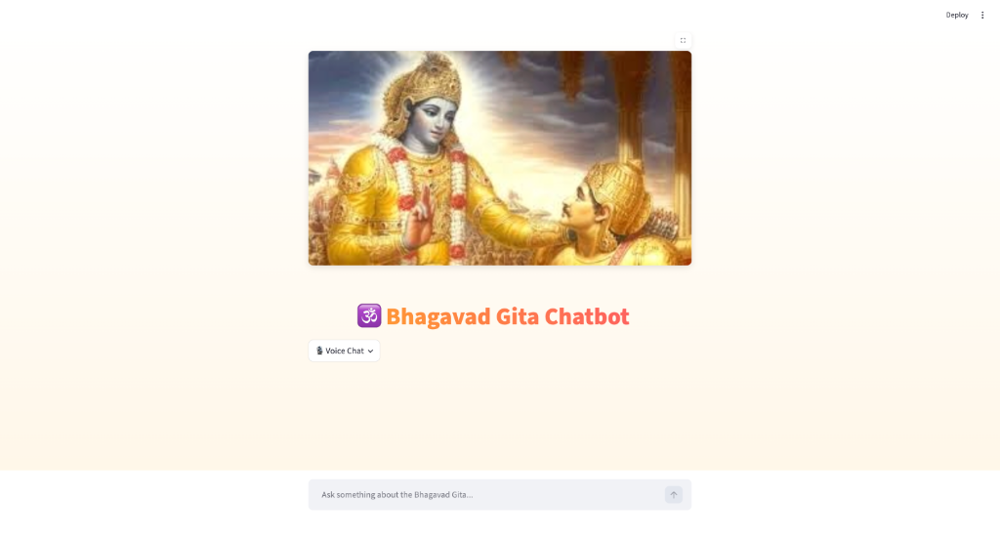
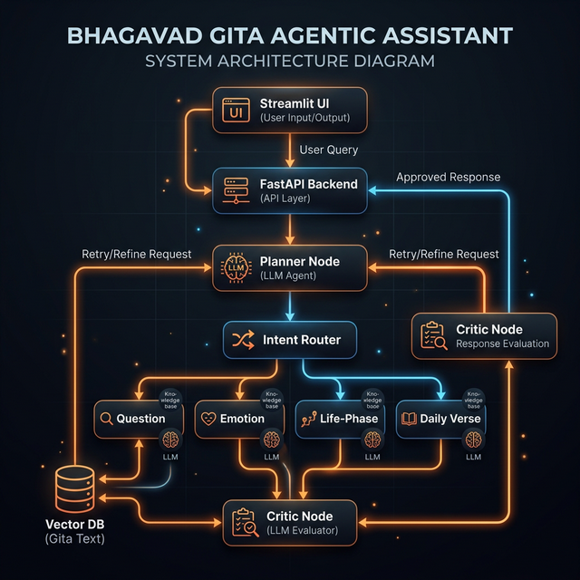

# GitaMind - Bhagavad Gita Agentic RAG Assistant 🕉️

A fully Agentic, LangGraph-powered Conversational AI grounded exclusively in the Bhagavad Gita (English – TTD Edition).



This is not a traditional RAG chatbot. This system utilizes a multi-stage Agentic architecture featuring intent planning, dynamic multi-tool routing, and a strict reflection loop (Critic Node) to enforce precise verse citations and high-confidence grounding.

## 🌟 What Makes This Agentic
Unlike a normal RAG pipeline, this system features:
- **Planner Node:** An LLM dynamically decides user intent (no keyword mapping).
- **Multi-Intent Handling:** Routes complex queries through multiple tools sequentially.
- **Critic Node (Reflection):** Evaluates the generated answers. If confidence is < 50% or if exact Chapter/Verse citations are missing, it actively rejects the answer and triggers a retry loop with a refined prompt to the Planner.
- **Guaranteed Grounding:** Refuses to hallucinate. If no verses match after 2 retries, it gracefully admits it cannot find the answer.

## 🎙️ Voice & Multilingual Support
- **Voice Interaction:** Speak your queries directly using the UI.
- **Speech-to-Text:** Powered by Whisper (Groq) for lightning-fast transcription.
- **Multilingual:** Answers in the language you ask (English, Hindi, Kannada, Sanskrit).
- **Text-to-Speech:** Listen to the generated responses natively via gTTS.


## 🧠 What the Agent Can Do
The agent understands your intent and routes requests automatically:
- "What is karma yoga?" → 📖 RAG question answering.
- "I feel anxious" → 💭 Emotion-based search to find comforting verses.
- "I am a student" → 🎓 Life-phase relevant guidance.
- "Give me today’s verse and my duty" → 🔀 Multi-intent routing (Daily Verse + Question)

## 🧬 System Architecture (Agentic RAG)

This assistant combines two powerful AI paradigms:
1. **Agentic Layer (The Brain):** Powered by LangGraph (`Planner Node`, `Intent Router`, `Critic Node`). It decides *what* needs to be done, plans the execution, and double-checks the final answer to ensure quality and strict citations.
2. **RAG Layer (The Knowledge):** Powered by Qdrant and LangChain (`rag_engine.py`). It retrieves grounded knowledge exclusively from the Bhagavad Gita.

Every time the Planner triggers an execution node (like the Question or Emotion node), it executes a strict RAG retrieval against the vector database to fetch the exact verses.



## 🛠️ Tech Stack
**AI Core**
- Python
- LangGraph (Agentic Orchestration)
- LangChain
- Groq LLM (LLaMA-3.1-8B)
- HuggingFace Embeddings (sentence-transformers/all-MiniLM-L6-v2)
- Qdrant Vector Database

**Web & Voice Layers**
- FastAPI (Backend API)
- Streamlit (Frontend UI)
- Whisper (Speech-to-Text via Groq)
- gTTS (Text-to-Speech)

## ⚙️ Setup Instructions

1️⃣ **Create Environment & Install Dependencies**
```bash
python3 -m venv venv
source venv/bin/activate

# Install backend dependencies
pip install -r backend/requirements.txt

# Install frontend dependencies
pip install -r frontend/requirements.txt
```

2️⃣ **Start Qdrant Vector DB (Docker required)**
```bash
docker run -d -p 6333:6333 -p 6334:6334 qdrant/qdrant
```

3️⃣ **Add Environment Variables (.env)**
Create a `.env` file in the backend folder:
```env
GROQ_API_KEY=your_groq_key_here
QDRANT_URL=http://localhost:6333
QDRANT_API_KEY=optional_qdrant_api_key_here
```

4️⃣ **Index the Bhagavad Gita PDF**
```bash
cd backend
python index.py
cd ..
```

5️⃣ **Start the Agent Backend (Terminal 1)**
```bash
cd backend
python -m uvicorn backend:app --reload --port 8000
```

6️⃣ **Start the Chat UI (Terminal 2)**
```bash
cd frontend
streamlit run app.py
```

👨‍💻 **Author**
**Abhinav Shrimali**
Building intelligent, explainable AI systems with Agentic Frameworks, LangGraph, and LLMs.