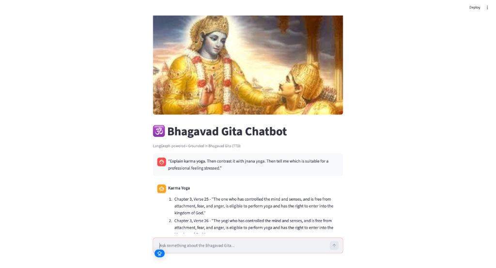

<<<<<<< HEAD
🕉️ Bhagavad Gita Agentic Assistant

A fully Agentic, LangGraph-powered Conversational AI grounded exclusively in the Bhagavad Gita (English – TTD Edition).

This is not a traditional RAG chatbot. This system utilizes a multi-stage Agentic architecture featuring intent planning, dynamic multi-tool routing, and a strict reflection loop (Critic Node) to enforce precise verse citations and high-confidence grounding.

🌟 What Makes This Agentic
Unlike a normal RAG pipeline, this system features:
✔ Planner Node: An LLM dynamically decides user intent (no keyword mapping).
✔ Multi-Intent Handling: Routes complex queries through multiple tools sequentially.
✔ Critic Node (Reflection): Evaluates the generated answers. If confidence is < 50% or if exact Chapter/Verse citations are missing, it actively rejects the answer and triggers a retry loop with a refined prompt to the Planner.
✔ Guaranteed Grounding: Refuses to hallucinate. If no verses match after 2 retries, it gracefully admits it cannot find the answer.

🧠 What the Agent Can Do
The agent understands your intent and routes requests automatically:
- "What is karma yoga?" → 📖 RAG question answering.
- "I feel anxious" → 💭 Emotion-based search to find comforting verses.
- "I am a student" → 🎓 Life-phase relevant guidance.
- "Give me today’s verse and my duty" → 🔀 Multi-intent routing (Daily Verse + Question)

🧬 System Architecture (Agentic RAG)

This assistant combines two powerful AI paradigms:
**Agentic Layer (The Brain)**: Powered by LangGraph (`Planner Node`, `Intent Router`, `Critic Node`). It decides *what* needs to be done, plans the execution, and double-checks the final answer to ensure quality and strict citations.
**RAG Layer (The Knowledge)**: Powered by Qdrant and LangChain (`rag_engine.py`). It retrieves grounded knowledge exclusively from the Bhagavad Gita.

Every time the Planner triggers an execution node (like the Question or Emotion node), it executes a strict RAG retrieval against the vector database to fetch the exact verses.

🛠️ Tech Stack
AI Core
- Python
- LangGraph (Agentic Orchestration)
- LangChain
- Groq LLM (LLaMA-3.1-8B)
- HuggingFace Embeddings (sentence-transformers/all-MiniLM-L6-v2)
- Qdrant Vector Database

Web Layers
- FastAPI (Backend API)
- Streamlit (Frontend UI)

📂 Project Structure
├── index.py              # PDF chunking and Qdrant ingestion
├── rag_engine.py         # RAG logic, strict system prompts, and Qdrant client
├── langgraph_agent.py    # The core LangGraph state machine (Planner, Router, Critic)
├── backend.py            # FastAPI endpoints
├── app.py                # Streamlit UI
├── requirements.txt
└── README.md

⚙️ Setup Instructions

1️⃣ Create Environment & Install Dependencies
python3 -m venv venv
source venv/bin/activate
pip install -r requirements.txt

2️⃣ Start Qdrant Vector DB (Docker required)
docker run -d -p 6333:6333 -p 6334:6334 qdrant/qdrant

3️⃣ Add Environment Variables (.env)
Create a `.env` file in the root directory:
GROQ_API_KEY=your_groq_key_here
QDRANT_URL=http://localhost:6333

4️⃣ Index the Bhagavad Gita PDF
python index.py

5️⃣ Start the Agent Backend
python -m uvicorn backend:app --reload

6️⃣ Start the Chat UI
streamlit run app.py

👨‍💻 Author
Abhinav Shrimali
Building intelligent, explainable AI systems with Agentic Frameworks, LangGraph, and LLMs.
=======
# Bhagavad Gita RAG Assistant 🕉️

A Voice-Enabled AI Chatbot grounded strictly in the Bhagavad Gita.

This project implements a Retrieval-Augmented Generation (RAG) system that answers user questions using verses from the Bhagavad Gita. The assistant supports multilingual voice interaction and ensures responses are strictly based on indexed scripture content.

---

## Overview

The Bhagavad Gita RAG Assistant is designed to:

- Answer philosophical and practical life questions using authentic verses
- Provide precise chapter and verse citations
- Support multilingual voice input and output
- Offer emotion-based guidance grounded in scripture
- Deliver a daily verse for reflection

The system prevents hallucinated responses by restricting generation to retrieved Gita content.

---

## Architecture

The application follows a structured RAG pipeline:

1. User Query (Text or Voice)
2. Speech-to-Text using Whisper
3. Embedding Generation
4. Vector Search in Qdrant
5. Context Retrieval (Relevant Verses)
6. LLM Response Generation using LLaMA 3.1 (Groq API)
7. Text-to-Speech Output using gTTS

This architecture ensures that every answer is traceable to scripture.

---

## Core Features

### 1. Scripture-Based Question Answering

- Retrieves semantically relevant verses
- Generates contextual explanations
- Always includes chapter and verse references

Example:

> "What does the Gita say about anger?"  
Returns verses such as Chapter 2, Verse 62–63.

---

### 2. Voice Interaction

- Users can speak queries directly
- Whisper converts speech to text
- Responses are converted back to speech using gTTS
- Supports multilingual voice queries

---

### 3. Multilingual Support

Supported languages:

- English
- Hindi
- Kannada
- Sanskrit

The assistant detects language context and generates responses accordingly.

---

### 4. Emotion-Based Guidance

Users can express emotional states such as:

- "I am confused"
- "I feel angry"
- "I feel hopeless"

The system maps emotional intent to relevant verses and provides contextual interpretation.

---

### 5. Verse of the Day

Provides:

- Sanskrit Shloka
- Transliteration
- Translation
- Brief explanation

---

## Tech Stack

### Frontend
- Streamlit

### LLM
- LLaMA 3.1 via Groq API

### Vector Database
- Qdrant

### Orchestration
- LangGraph

### Voice Stack
- Whisper (Speech-to-Text)
- gTTS (Text-to-Speech)

### Embeddings
- Compatible embedding model (e.g., OpenAI or Groq-supported model)

---

>>>>>>> 90761455e4a2cccdb357a316a20fd7c0bd1cb5be
